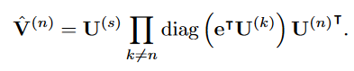
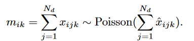

# 通过隐相互作用张量分解联合学习表型和诊断药物对应

|    Title     | Joint Learning of Phenotypes and Diagnosis-Medication Correspondence via Hidden Interaction Tensor Factorization |
| :----------: | ------------------------------------------------------------ |
|    Author    | Kejing Yin;  William K. Cheung;  Benjamin C. M. Fung;  Jonathan Poon |
| Affiliations | Department of Computer Science, Hong Kong Baptist University;  School of Information Studies, McGill University, Montreal, Canada;Hong Kong Hospital Authority, Hong Kong |
|    Emails    | {cskjyin, william}@comp.hkbu.edu.hk; ben.fung@mcgill.ca; jonathan@ha.org.hk |
|    Paper     | https://www.ijcai.org/Proceedings/2018/0504.pdf              |
|     Code     | https://github.com/jakeykj/hitf                              |

# 摘要

Non-negative tensor factorization has been shown effective for discovering phenotypes from the EHR data with minimal human supervision. In most cases, an interaction tensor of the elements in the EHR (e.g., diagnoses and medications) has to be first established before the factorization can be applied. Such correspondence information however is often missing. While different heuristics can be used to estimate the missing correspondence, any errors introduced will in turn cause inaccuracy for the subsequent phenotype discovery task. This is especially true for patients with multiple diseases diagnosed (e.g., under critical care). To alleviate this limitation, we propose the hidden interaction tensor factorization (HITF) where the diagnosis-medication correspondence and the underlying phenotypes are inferred simultaneously. We formulate it under a Poisson non-negative tensor factorization framework and learn the HITF model via maximum likelihood estimation. For performance evaluation, we applied HITF to the MIMIC III dataset. Our empirical results show that both the phenotypes and the correspondence inferred are clinically meaningful. In addition, the inferred HITF model outperforms a number of stateof-the-art methods for mortality prediction.

非负张量分解已被证明可以有效地从EHR数据中发现表型，并且只需要很少的人工监督。在大多数情况下，必须首先建立EHR (例如,诊断和药物治疗)中元素的相互作用张量才能应用因子分解。然而这样的对应信息往往是缺失的。虽然可以使用不同的启发式来估计缺失的对应关系，但是引入的任何错误都会反过来为后续的表型发现任务造成不准确性。对于诊断为(例如,在重症监护下)的多种疾病患者尤其如此。为了缓解这一限制，我们提出了隐交互张量分解( HITF )，在该方法中，诊断-用药对应关系和潜在表型被同时推断。我们在一个泊松非负张量分解框架下对其进行建模，并通过极大似然估计来学习HITF模型。为了评估性能，我们将HITF应用于MIMIC III数据集。我们的实证结果表明，无论是表型还是推断的对应关系都具有临床意义。此外，推断的HITF模型在死亡率预测方面优于一些最先进的方法。

## 表型提取

表型被正式定义为一组高度相关且能更好地表征患者健康状况的临床特征，而表型提取就是从电子健康记录（EHR）中提取出一组表征患者健康状况的临床特征。传统上，表型分析是以监督的方式进行的，涉及到手动标记病例和对照患者，并总结和提炼针对特定疾病的判别特征的迭代过程，这显然是费时费力的。为了加快表型分析的速度，应用机器学习方法，特别是无监督的方法，从大规模的EHR数据中自动提取表型。其中，非负张量CP分解由于其高度的可解释性和保持高阶相互作用的能力应用于表型提取中。例如，可以构造一个三阶张量X来表示患者、诊断和药物之间的相互作用，其中张量条目可以解释为"患者p是响应诊断d的处方药物m "。与二维非负矩阵分解一样，非负CP分解以一个高阶相互作用张量作为输入，学习一组非负秩1张量来逼近输入张量。由于其线性和可加性，非负CP分解能够揭示数据背后的"部分-整体"关系。

尽管非负CP分解在表型分析中取得了巨大成功，但仍有一些基本挑战阻碍了它在一些实际场景中的应用。

作为包括非负CP分解在内的任何普通张量分解模型的输入，张量需要被很好地定义以表示不同模态之间的相互作用。然而，这些信息在实践中往往无法获得。以诊断和用药为例，EHR数据通常只包含患者的诊断列表和药物处方列表，而药物与诊断之间的对应关系完全没有记录。现有的方法转向一种替代策略，即**考虑"共现"关系**，即隐含假设在同一临床访问中同时出现的所有药物和诊断将相互对应。这种"等对应"的假设对于某些特定类型的数据集是合理的，例如初级保健或门诊数据，在这些数据集中，患者通常在每次临床访问中都有非常不同的诊断，处方药物与诊断有关。然而，现实世界中的EHR数据往往是高度复杂的，例如住院或重症监护数据，其中患者通常具有非常复杂的医疗条件：患者可以分配超过十几个诊断代码和数十种药物。在这种情况下，"对等"假设不再成立。

## 关于张量的知识

### 张量分解（Tensor Factorization）

X是由EHR数据构成的交互张量，X中的值代表项目在不同模态（如疾病、诊断、用药等）之间的共现数目，经过CP分解，可表现为如下形式：

我们考虑一个三阶的张量X，由三个模态构成（patients, Rx, Dx），假设秩为R，可做如下图的分解：

X张量可看做是R个潜在概念的总和，每个潜在概念对应一个秩一张量，这个秩一张量就是我们可提取出的表型。本质上，提取第r个秩一张量中每个模态中具有正值的项作为第r个表型的定义。

### 张量切片（Tensor Slice）

我们定义张量的一个切片为固定张量的除两个下标外的所有指标得到的矩阵。例如，对于一个三阶张量X，在固定其余张量(本例中的第一种和第三种模式)的情况下，通过改变张量(本例中的第一种和第三种模式)的两个下标得到切片X :j: , 根据CP因子矩阵的定义，切片X:j: ,可以表示为:

### 张量边缘化（Tensor Marginalization）

我们定义张量的边缘化为张量沿两个固定模式的所有切片求和得到的矩阵。对于三阶张量X，沿第二维的累积量为：

## HITF

HITF旨在发现**边缘化观测下不同模态项目之间的不可观测对应关系**。在普通的CP分解中，因子可以通过最小化重构误差或最大化输入张量的似然来估计。然而，在HITF的设定中，我们只观察到高阶相互作用张量的边缘化。因此，我们通过最大化边缘化的可能性来求解因子，而不是张量X本身。为此，我们首先将同样的边缘化应用于重构，得到沿第n维的边缘化如下：

令表示一组N个观测矩阵，每个观测矩阵对应一个特定的模态。我们假设观测矩阵是通过边缘化描述模态间相互作用的不可观测的高阶张量生成的。作为示例，下图描述了EHR中具有两种模态的HITF模型：用药处方（medication prescriptions）和诊断代码（diagnosis codes）。我们观察两个矩阵：患者-药物（patient-by-medication）矩阵V ( 1 )和患者-诊断（patient-by-diagnosis）矩阵V ( 2 )，分别记录每个患者的处方药物和诊断代码。可以合理地假设这两种模式之间存在某种对应关系——根据某些诊断向患者开出药物。**因此，我们假设存在一个具有N + 1个模态的高阶隐相互作用张量X，描述模态间的对应关系，并通过边缘化隐相互作用张量得到观测矩阵V。**

## 模型的求解

我们将该问题建模为一个泊松非负张量分解( Poisson NTF )问题，其中患者、诊断和药物之间的相互作用通过一个隐藏的患者-诊断-药物张量X进行显式建模，( i ; j ; k) - th条目Xijk表示在诊断j时为患者i开出的药物数量k。标准Poisson NTF模型通过最大化输入张量的似然来求解CP因子矩阵。然而，在我们的例子中，描述相互作用的张量实际上并没有被观测到。相反，我们观察到隐藏的相互作用张量的累积，例如患者-药物矩阵M，其中每个条目mik = c表示给患者i (在不知道它对应哪种诊断的情况下)开c次药。独立泊松分布之和产生另一个泊松分布，其均值为组成泊松分布的参数之和，即：

患者-药物（patient-by-medication）矩阵V ( 1 )和患者-诊断（patient-by-diagnosis）矩阵V ( 2 )同时也服从泊松分布：

需要推断的变量为CP因子矩阵U ( 1 )、U ( 2 )和U ( 3 )。我们推导了观测值M和D的联合对数似然，并通过最大化联合对数似然来推断变量：

其中，

我们通过最小化非负约束下的负对数似然来估计变量。优化问题表述如下：

我们通过块坐标下降法求解优化问题，对于每一次内部迭代，我们通过固定所有待更新的因子矩阵来求解子问题，过程如算法1所示。我们应用投影线性搜索来求解子问题，过程如算法2所示。

## 实验结果

